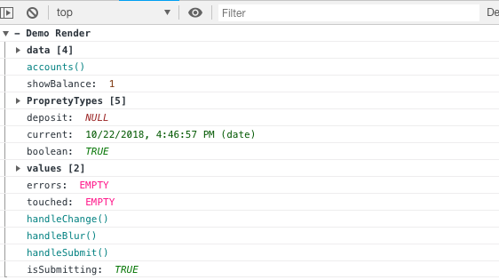
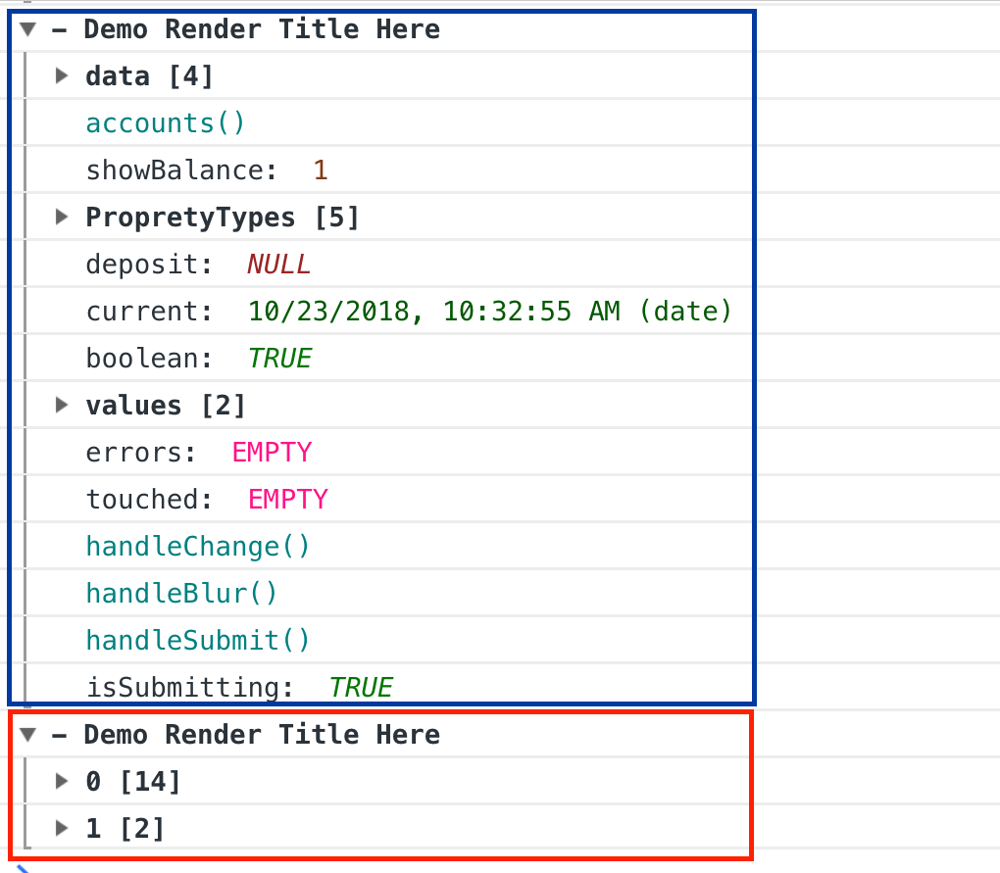
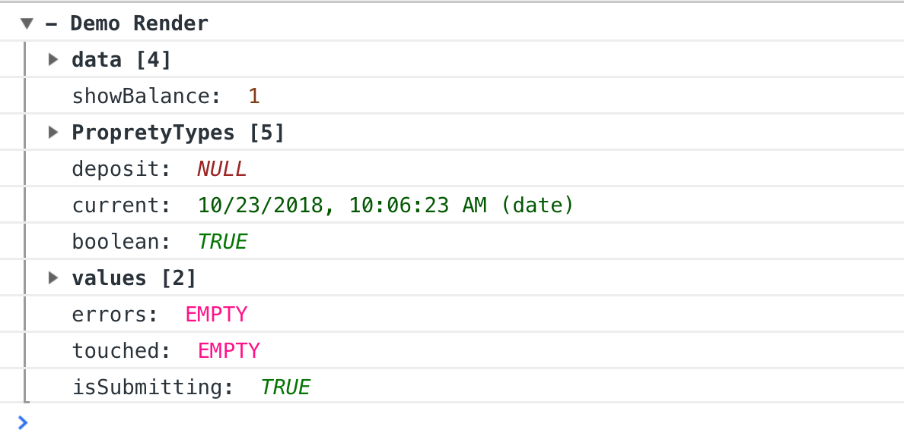
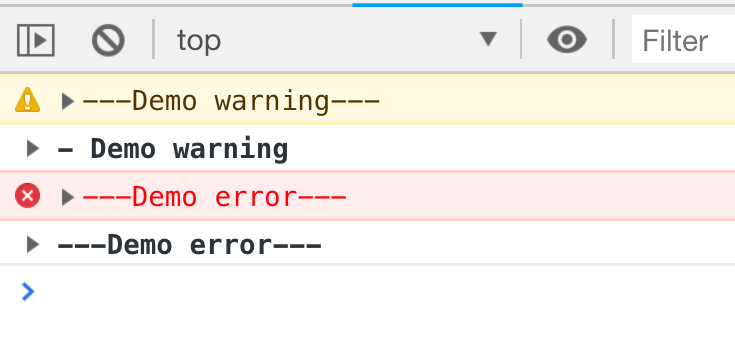
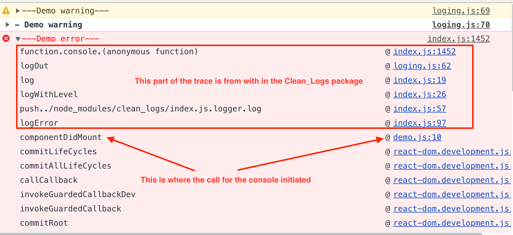

**console-logging**

Turn your plain console form this


To this,



A wrapper around usual console.log() - This is a utility that I use along with frontend React project to visualize complex objects.
You can use the console logs for debugging and easily turn them on/off by setting the logging level and have logs that are clear to read.

## Usage

Install
```
npm i clean_logs
```
```
const logging = require("clean_logs");
const logger = logging.logger;
```

or ES6 import

```
import {LOGGING_LEVELS, logger } from 'clean_logs';
```

## Logging Level

The use case of logger.setLevel() is in production environment, just switch on/off the logger and you have extra debug logs!
So remember to include logger.xyz() during app development.

```
logger.setLevel(logging.LOGGING_LEVELS.CRITICAL)
logger.setLevel("CRITICAL")  // Supports string levels: CLEAR, DEBUG, DEBUGDATA, WARNING, ERROR,

// or get level from environment variable
logger.setLevel(process.env.LOGGING_LEVEL)  // process.env.LOGGING_LEVEL = "CLEAR|DEBUG|DEBUGDATA|WARNING|ERROR"

logger.error("Transaction fail, transaction id 1")  // No output

logger.setLevel(logging.LOGGING_LEVELS.ERROR)
logger.error("Transaction fail, transaction id 1")  // Output 'Transaction fail, transaction id 1'

// multi-args is supported with any combination of strings, objects, arrays or functions.
logger.error("Hi", "I am", "an error")  // Output 'Hi I am an error'
```

## Log Formatting

You have 5 log type clear, debug, debugdata, warning, error.
They all have the same great formating but each have some unique diferences.
This is how a console.log fo this.props on a React App looks

Example:

```
import React, { Component } from 'react';
import { LOGGING_LEVELS, logger } from 'clean_logs';

logger.setLevel(LOGGING_LEVELS.DEBUG);

class Demo extends Component {
  componentDidMount() {
    console.log(this.props);
    logger.debug('Demo Render', this.props);
  }
  render() {
    return <div>Test</div>;
  }
}

export default Demo;
```

## logger.debug

If you pass a string as one of the parameters clean_logs will use it as the title of the group.
It groups any object or arrays
every type is displayed with a unique color and style,

- Arrays or Objects will be grouped and the length of the objects added to the label
- Functions are DarkCyan <span style="color:DarkCyan"> someFuntion()</span>.
- Numbers are SaddleBrown and italic <span style="color:SaddleBrown ; font-style: italic"> 100</span>.
- string are blue <span style="color:blue  "> SomeString</span>
- undefined are Chocolate and italic <span style="color:Chocolate ; font-style: italic"> UNDEFINED</span>
- null are Brown and italic <span style="color:Brown ; font-style: italic"> NULL</span>
- dates are DarkGreen <span style="color:DarkGreen  "> 10/10/2018</span>
- moment object is ForestGreen and formated as lll <span style="color:ForestGreen  "> 10/10/2018</span>
- EMPTY are DeepPink <span style="color:DeepPink ; font-style: italic"> EMPTY</span>

```
1    logger.debug('Demo Render Title Here', this.props);
2    logger.debug(this.props, 'Demo Render Title Here');
3    logger.debug(this.props, 'Demo Render Title Here', {
4      a: 100,
5      x: 'more messages',
6    })
```

Lines 1 and 2 generated the same <span style="color:blue  "> output </span> title on the to of the group and because we only have one object or array the group is open by default

Line 3 generates a title on the top and each object is on a separated group with a number indication the length of the object.



## logger.debugdata

Same as logger.debug but it strips out any function from the output, good for when you are debugging only the data in the console.



## logger.warning logger.error

Same as logger.debug, any strings parameters will be added to the top of the group with orange or red label, the group data will default to a close group.


The color label can be open to show a trace for you to find out where the console.log was called from, it is not a very clean trace but I still find it usefull.



## License

MIT
