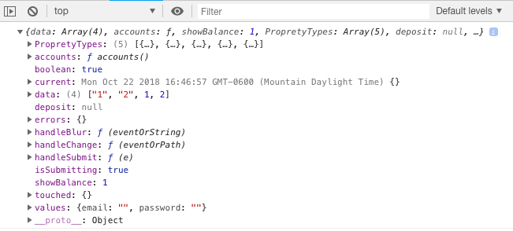

**console-logging**

A wrapper around usual console.log() - This is a utility that I want to use along my frontend projects where I need to include logs for debugging and can easily turn them on/off by setting the logging level and make the console much easy to read.

## Usage

```
const logging = require("clean_logs");
const logger = logging.logger;
```

or ES6 import

```
import {LOGGING_LEVELS, logger } from 'clean_logs';
```

## Loggin Level

The use case of logger.setLevel() is in production environment, just switch on/off the logger and you have extra debug logs!
So remember to include logger.xyz() during app development.

```
logger.setLevel(logging.LOGGING_LEVELS.CRITICAL)
logger.setLevel("CRITICAL")  // Supports string levels: CLEAR, DEBUG, DEBUGDATA, WARNING, ERROR,

// or get level from environment variable
logger.setLevel(process.env.LOGGING_LEVEL)  // process.env.LOGGING_LEVEL = "CLEAR|DEBUG|DEBUGDATA|WARNING|ERROR"

logger.error("Transaction fail, transaction id 1")  // No output

logger.setLevel(logging.LOGGING_LEVELS.ERROR)
logger.error("Transaction fail, transaction id 1")  // Output 'Transaction fail, transaction id 1'

// multi-args is supported
logger.error("Hi", "I am", "an error")  // Output 'Hi I am an error'
```

## Log Types

You have 5 log type clear, debug, debugdata, warning, error.
They all have the same great formating but each have some unique diferences

```
Here is the console.log from a react app

clear
```

## License

MIT
